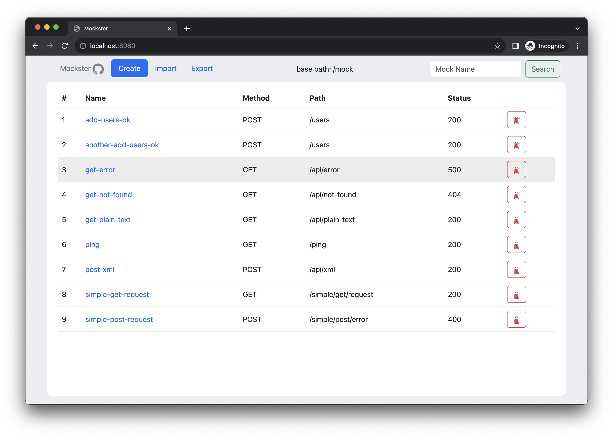
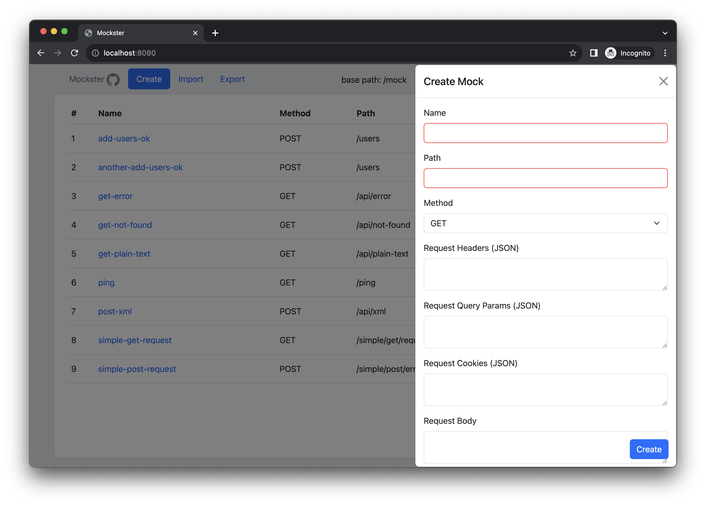

# Mockster [](https://github.com/gonfff/mockster/actions/workflows/ci.yaml) [](https://goreportcard.com/report/github.com/gonfff/mockster) [](https://coveralls.io/github/gonfff/mockster?branch=master) [](https://codecov.io/gh/gonfff/mockster)

Mockster is a minimalistic, lightweight and simple mock server for testing your http clients. It can be embedded in your CI pipeline for tests or used as a standalone server while developing your application.

---
## Run app

```bash
docker run -p 8080:8080 --rm ghcr.io/gonfff/mockster:<version>
```

## Create mocks
* by YAML-file with environment variable MOCK_FILE_PATH can be provided ([example](examples/mocks.yaml))
* by sending a POST request to the `/management/mocks` endpoint with the following body ([example](examples/curl.txt))
* by importing YAML-file with UI
* by creating mock with UI

## Request mocks

By sending a request to the `/mocks/<your_path>` endpoint and providing all nessessary headers, body, cookies, query params.

## UI
Mockster has a simple UI for creating and managing mocks. It is available on the `/` endpoint.




## Environment variables
- `MOCK_FILE_PATH` - path to YAML-file with mocks
- `LOG_FORMATTER` - log formatter (text or json)
- `PORT` - port on which the server will be running
- `STATIC_PATH` - path to static files (UI)

---
#### Additional info
Thats my first Go, Bootstrap, JS project, so I will be glad to hear any feedback and suggestions.
Feel free to open issues and PRs.